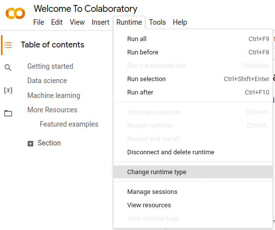
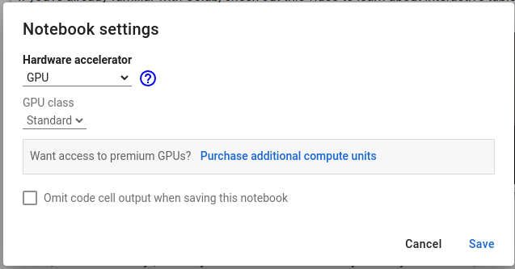
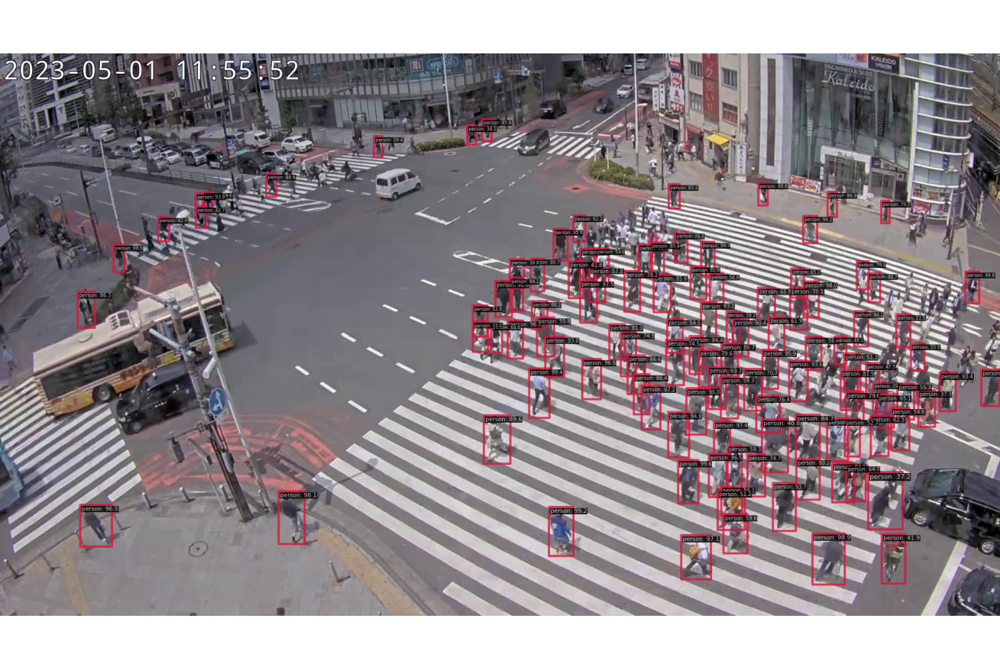

# Building a Car Counter
Building a People Counter with mmdetection, python, and OpenCV.

This is a beginner machine learning project. It is the accompanying code for videos that can be found here:
- [Tiktok](https://www.tiktok.com/@codingai/video/7223464864193269038)

This project is intended as a demonstration, and there will be no support.

## Requirements

You need to install the following.

1. Python - [Installation](https://www.python.org/downloads/)
1. OpenCV, Matplotlib
```
pip install opencv-python
pip install matplotlib
```
3. MMDetection - [Installation](https://github.com/open-mmlab/mmdetection)
4. This repository!
```
git clone https://github.com/eric-yim/streaming-people-counter
```

### If you don't have a GPU for Object Detection

I strongly recommend having a GPU for object detection. If you don't have one set up, MMDetection can be run on a CPU, but it will be very slow. Alternatively, you can use [google colab](https://colab.research.google.com/).





Then, instead of running the code on a webcam, you would instead run the code on a video file. You'll have to use colabs built in visualizer instead of cv2.imshow.

## Running the Code

The main entry to the code is ```run.py```. There are a list of command line arguments at the start of the file.
List of arguments:
- ```--config``` The location for the mmdetection config file.
- ```--checkpoint``` The location of the checkpoint for the trained model.
- ```--input``` The filepath of the input video OR the name of the camera. (Your camera may be called "/dev/video0" on linux or "0" on PC)
- ```--interval``` Frame interval to process. You should set this to 1 for a live camera. If you are processing a video, setting this to a higher value allows you to skip frames.
- ```--cross``` The points of the counting line. [[X,Y],[X,Y]]
- ```--crop``` Values for cropping the image before processing. [Y0,Y1,X0,X1]

### Running the System
This opens the camera, runs the system, and shows a visualization on screen. Meanwhile, it appends counts to a file called ```totals.csv```. Press "q" to exit.

```
python run.py
```

Running on a live camera.
```
python run.py --input /dev/video0
```

Running on a video.
```
python run.py --input PATH_TO_MY_VIDEO.mp4
```
### Running only the Object Detector
You can also run only the Object Detector on the sample image provided.
```
python run.py --single
```
You should get an image like this.


### Displaying Results
There are sample counts stored in ```totals.csv```. You can display them.
```
python analyze.py
```
